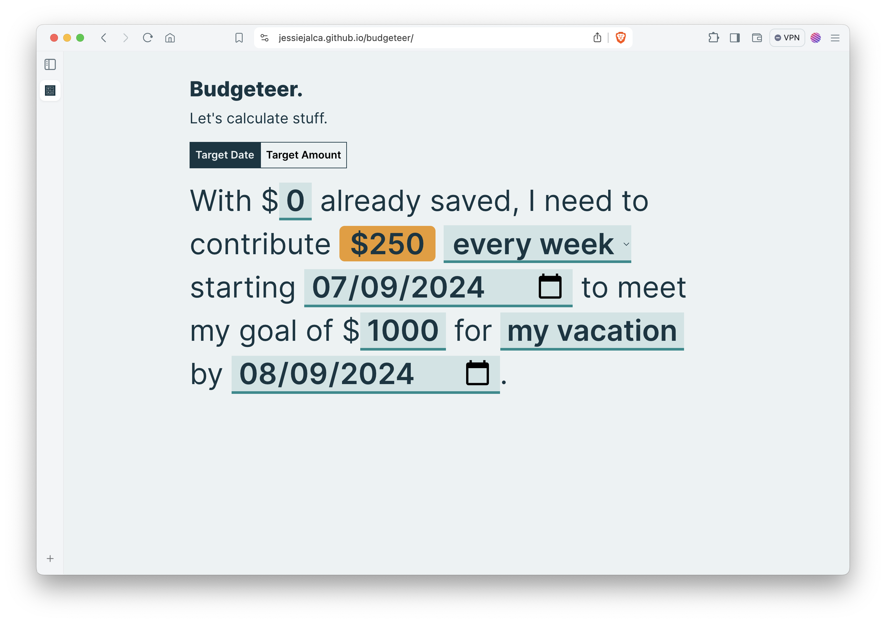

# Budgeteer

A [simple budget calculator tool](https://jessiejalca.github.io/budgeteer/) to help with envelope budgeting calculations. Figure out how much you need to save per week, every other week, or month to reach your savings goal by a certain date. Or see how long it'll take you to reach a goal based on a scheduled funding amount.

## Built With

- [React v18.3.3](https://react.dev/) - Frontend web library
- [TypeScript](https://www.typescriptlang.org/) - Programming language
- [GitHub Copilot](https://docs.github.com/en/copilot) - AI pair programmer

## Authors

- [Jessie Jalca](https://jessiejalca.dev) - _Initial Work_ - [Github](https://github.com/jessiejalca)

## License

This project is licensed under the MIT License.
